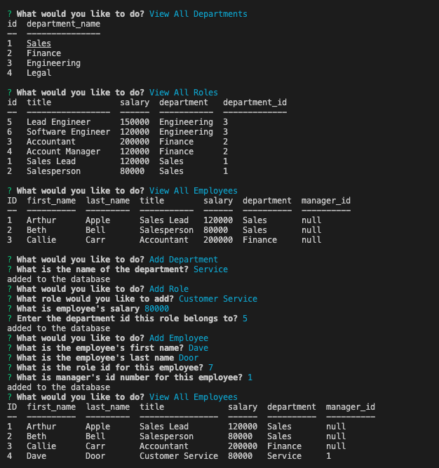

# Employee Database

## Description
The Employee Database is an application for businesses to be able to view and manage departments, roles, and employees in their company so that they can organize and plan their business. 

## Table of Contents
  * [Installation](#installation)
  * [Technologies](#technologies-used)
  * [Usage](#usage)
  * [License](#license)
  * [Contributors](#contributors)
  * [Tests](#tests)
  * [Questions](#questions)
## Installation
[MySQL2 package](https://www.npmjs.com/package/mysql2) to connect to your MySQL database and perform queries

[Inquirer package](https://www.npmjs.com/package/inquirer/v/8.2.4) to interact with the user via the command line

[console.table package](https://www.npmjs.com/package/console.table) to print MySQL rows to the console
## Technologies used
`Javascript`
   
`Node.js`
   
`MySQL2`
   
`NPM`
   
`Inquirer`
## Usage
View a walk through video [here](https://drive.google.com/file/d/17sr7Q8akJZsHeQUe8jw65lnGDvf7th1n/view).

To launch the application from the command-line:

* Navigate to the project's root directory and run:
  `node index.js`
* Answer prompts

 

## License
  This application is licensed under [MIT]((https://opensource.org/licenses/MIT)). 
    Copyright &copy; 2022 Jamie Otto
  

## Contributors
  Jamie Otto

## Questions
  If you have any questions about this project, please contact [jmotto31@gmail.com](mailto:jmotto31@gmail.com). To view more of my projects, go to [jmotto](https://github.com/jmotto).